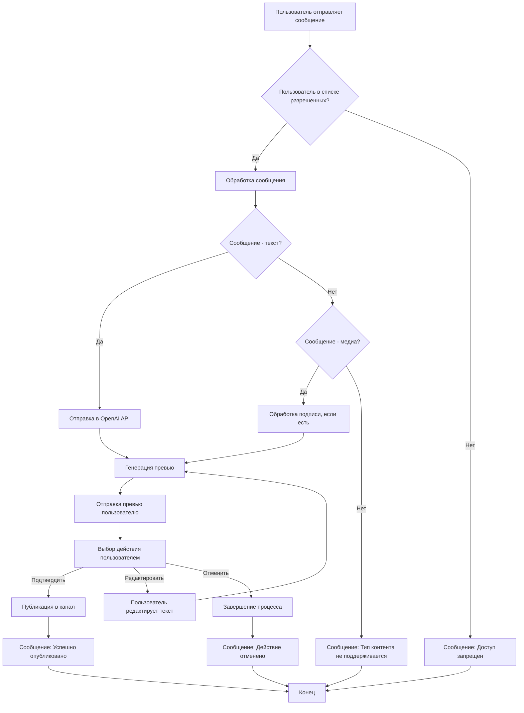

```mermaid
graph TD
    A[Пользователь отправляет сообщение] --> B{Пользователь в списке разрешенных?}
    B -- Да --> C[Обработка сообщения]
    B -- Нет --> D[Сообщение: Доступ запрещен]
    C --> E{Сообщение - текст?}
    E -- Да --> F[Отправка в OpenAI API]
    E -- Нет --> G{Сообщение - медиа?}
    G -- Да --> H[Обработка подписи, если есть]
    G -- Нет --> I[Сообщение: Тип контента не поддерживается]
    F --> J[Генерация превью]
    H --> J
    J --> K[Отправка превью пользователю]
    K --> L[Выбор действия пользователем]
    L -- Подтвердить --> M[Публикация в канал]
    L -- Редактировать --> N[Пользователь редактирует текст]
    N --> J
    L -- Отменить --> O[Завершение процесса]
    M --> P[Сообщение: Успешно опубликовано]
    O --> Q[Сообщение: Действие отменено]
    D --> R[Конец]
    I --> R
    P --> R
    Q --> R

```
